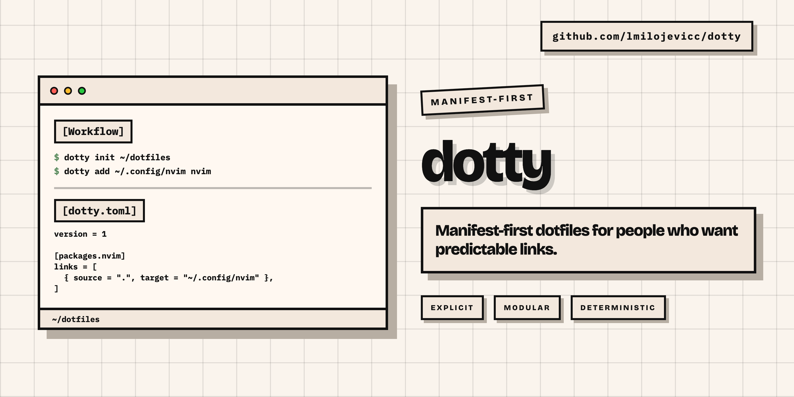

<!-- prettier-ignore -->
<div align="center">

# Dotty

_Sync configuration files across machines using a manifest._

[Features](#features) | [Installation](#installation) | [Workflow](#basic-workflow) | [Commands](#commands) | [Advanced](#advanced) | [Development](#development)

</div>



## Features

- **Explicit manifest**: Every managed target is recorded in `dotty.toml` as a source-to-target manifest entry.
- **Selector-based commands**: Use `package` to act on a whole package or `package/source` to act on one repository source.
- **Safe by default**: Non-symlink content at a target is a conflict unless you explicitly pass `--force`.
- **Dry runs**: Preview `add`, `track`, `untrack`, `link`, and `unlink` operations without changing files.
- **Collections**: Link or unlink named groups of packages.
- **Status reporting**: See linked, unlinked, partial, conflict, blocked, missing-source, empty, and untracked states.
- **Unlink control**: `unlink` removes expected Dotty links by default; pass `--leave-copy` to leave target-side copies.

## Installation

Install with Go:

```bash
go install github.com/lmilojevicc/dotty/cmd/dotty@latest
```

If `dotty` is not found after installing, make sure Go's binary directory is on your `PATH`:

```bash
export PATH="$(go env GOPATH)/bin:$PATH"
```

To pin a specific release:

```bash
go install github.com/lmilojevicc/dotty/cmd/dotty@v0.1.2
```

Prebuilt archives are also available on [GitHub Releases](https://github.com/lmilojevicc/dotty/releases).

## Basic Workflow

```bash
# Initialize a repository and remember it as the default
dotty init ~/dotfiles

# Move ~/.config/tmux into ~/dotfiles/tmux and link it back
dotty add ~/.config/tmux tmux

# Preview the same add operation without writing files
dotty add --dry-run ~/.config/tmux tmux

# Track an existing repository source without changing target-side files
dotty track scripts/docx2pdf ~/.local/bin/docx2pdf
dotty track --dry-run scripts/docx2pdf --target ~/.local/bin/docx2pdf

# Link a package or a single source
dotty link --dry-run tmux
dotty link tmux
dotty link scripts/docx2pdf

# Track and link repository content in one atomic operation
dotty link scripts/docx2pdf --target ~/.local/bin/docx2pdf --track

# Unlink a package or a single source; default unlink removes expected links
dotty unlink --dry-run tmux
dotty unlink tmux
dotty unlink scripts/docx2pdf

# Leave target-side copies instead of removing links outright
dotty unlink --leave-copy --dry-run tmux
dotty unlink --leave-copy tmux

# Remove manifest entries without changing target-side files
dotty untrack scripts/docx2pdf --target ~/.local/bin/docx2pdf

# Unlink and remove manifest entries in one atomic operation
dotty unlink scripts/docx2pdf --target ~/.local/bin/docx2pdf --untrack

# Link or unlink every package in the manifest
dotty link --all
dotty unlink --all

# Inspect manifest inventory and filesystem state
dotty repo
dotty list
dotty list scripts
dotty status
dotty status scripts/docx2pdf
dotty status --state blocked
dotty status --verbose
```

> [!WARNING]
> `dotty link --force` destructively replaces target conflicts before creating links. Use `dotty link --force --dry-run <selector>` first when you are not certain what will be replaced.

## Manifest

Dotty stores repository state in `dotty.toml` at the root of the repository.

```toml
version = 1

[packages.tmux]
links = [
  { source = ".", target = "~/.config/tmux" },
]

[packages.zsh]
links = [
  { source = ".zshrc", target = "~/.zshrc" },
  { source = ".zshrc_secrets", target = "~/secrets/.zshrc_secrets" },
]

[collections.terminal]
packages = ["tmux", "zsh"]
```

Collections are explicit package lists:

```bash
dotty link --collection terminal
dotty unlink --collection terminal
```

`--all` cannot be combined with package names or `--collection`.

> [!NOTE]
> Dotty normalizes `dotty.toml` when commands write the manifest. Hand formatting and comments in the manifest are not preserved.

Use `dotty track <selector> <target>` or `dotty track <selector> --target <target>` to add manifest entries for repository content that already exists. `track` only edits the manifest; it does not create target-side links. Use `dotty link <selector> --target <target> --track` when a repository source exists and you want to record and link it in one operation.

Use `dotty untrack <selector> [target...]` or `dotty untrack <selector> --target <target>` to remove manifest entries without unlinking, deleting, copying, or replacing target-side content. If target-side links still exist, `untrack` reports that they were not removed. If the last entry is removed, the package remains in the manifest as an empty package.

Use `--target <target>` with `dotty link`, `dotty unlink`, or `dotty untrack` to narrow one selector to individual targets. `--target` is not valid with multiple selectors, `--all`, or `--collection`.

Competing package alternatives may declare the same target across packages. Dotty reports an alternative as `BLOCKED` when that target is currently linked by another managed package. `dotty link --force <package>` switches a blocked target to the selected package; a single command may not select two alternatives that compete for the same target.

## Commands

| Command                                                           | Purpose                                                        | Useful flags                                                |
| ----------------------------------------------------------------- | -------------------------------------------------------------- | ----------------------------------------------------------- |
| `dotty init [<path>]`                                             | Initialize a repository and remember it as the default.        | None                                                        |
| `dotty add <path> <package>`                                      | Adopt an existing file, directory, or symlink target.          | `--dry-run`                                                 |
| `dotty track <selector> [target...]`                              | Add manifest entries without changing target-side files.       | `--target`, `--dry-run`                                     |
| `dotty untrack <selector> [target...]`                            | Remove manifest entries without changing target-side files.    | `--target`, `--dry-run`                                     |
| `dotty link <selector>... \| --all \| --collection <collection>`  | Create links for selected packages or `package/source` values. | `--all`, `--collection`, `--target`, `--track`, `--force`, `--dry-run` |
| `dotty unlink <selector>... \| --all \| --collection <collection>` | Remove links for selected packages or `package/source` values. | `--all`, `--collection`, `--target`, `--leave-copy`, `--untrack`, `--dry-run` |
| `dotty status [<selector>...]`                                    | Show state inferred from the manifest and filesystem.          | `--state`, `--verbose`, `-v`                                |
| `dotty list [<package>]`                                          | List packages and collections, or one package's entries.       | None                                                        |
| `dotty repo`                                                      | Show the resolved repository and config file path.             | None                                                        |
| `dotty completion <shell>`                                        | Generate shell completion scripts.                             | `bash`, `zsh`, `fish`, `powershell`                         |

Commands that operate on an existing repository accept the global `--repo` flag. `dotty init` creates or records the default repository and rejects `--repo`.

`dotty status` prints the resolved repository, package states, untracked repository content, and a summary count. With no selector arguments, it shows package summary rows plus all untracked repository content discovered in the repository. Package-scoped status only scans the selected package roots for untracked content, so top-level repository entries and unselected packages do not leak into the result. Package/source selectors, such as `dotty status scripts/docx2pdf`, show only matching manifest entries and untracked content under that source directory. Use `--state <state>` to keep aggregate package rows and untracked rows that match a state. Supported values are `linked`, `unlinked`, `partial`, `conflict`, `blocked`, `missing-source`, `empty`, and `untracked`. Use `dotty status --verbose` or `dotty status -v` for per-entry status. A single selector implies verbose output; multi-selector status remains aggregate-only by default unless you use `--verbose` or `--state untracked`.

`dotty list` remains aggregate inventory by default. `dotty list <package>` prints that package's manifest entries without checking filesystem state. `list` accepts package selectors only, not `package/source` selectors.

## Status States

Dotty renders status labels in uppercase, while `--state` accepts lowercase or kebab-case filter values:

- `LINKED` (`--state linked`): the target is a symlink to the expected source.
- `UNLINKED` (`--state unlinked`): the source exists and the target does not exist.
- `PARTIAL` (`--state partial`): a package has mixed manifest-entry states.
- `CONFLICT` (`--state conflict`): the target exists as non-symlink content or points to another source.
- `BLOCKED` (`--state blocked`): the target is currently linked by another managed package.
- `MISSING SOURCE` (`--state missing-source`): the manifest references a source that does not exist.
- `EMPTY` (`--state empty`): the package has no manifest entries.
- `UNTRACKED` (`--state untracked`): repository content or selected package-local content is not represented in the manifest.

## Advanced

### Shell Completions

Dotty can generate completion scripts for common shells:

```bash
dotty completion bash
dotty completion zsh
dotty completion fish
dotty completion powershell
```

Generated completions suggest Dotty-aware values when the manifest can be resolved: packages, `package/source` selectors, collections, and status states. Every `--target` flag uses normal filesystem path completion, like entering a path in the shell. Path arguments such as `dotty add <tab>`, `dotty init <tab>`, `dotty track <selector> <tab>`, and `--repo <tab>` also keep filesystem completion.

Example local installs:

```bash
# Bash
mkdir -p ~/.local/share/bash-completion/completions
dotty completion bash > ~/.local/share/bash-completion/completions/dotty

# Zsh
mkdir -p ~/.zsh/completions
dotty completion zsh > ~/.zsh/completions/_dotty

# Fish
mkdir -p ~/.config/fish/completions
dotty completion fish > ~/.config/fish/completions/dotty.fish
```

### Repository Selection

Dotty resolves the repository in this order:

1. The `--repo` command flag.
2. The `DOTTY_REPO` environment variable.
3. `~/.config/dotty/config.toml`, or `$XDG_CONFIG_HOME/dotty/config.toml` when `XDG_CONFIG_HOME` is set.

`dotty init <path>` records the default repository in the user config file. Because `init` is the command that records the default repository, it does not accept `--repo`.

## Development

Contributor tool versions and tasks are defined in `mise.toml`.

```bash
mise trust && mise install
mise run fmt
mise run verify
```

To build from source:

```bash
go build -o dotty ./cmd/dotty
./dotty --help
```

For terminology and design rationale, see [`CONTEXT.md`](CONTEXT.md) and the ADRs in [`docs/adr`](docs/adr).
